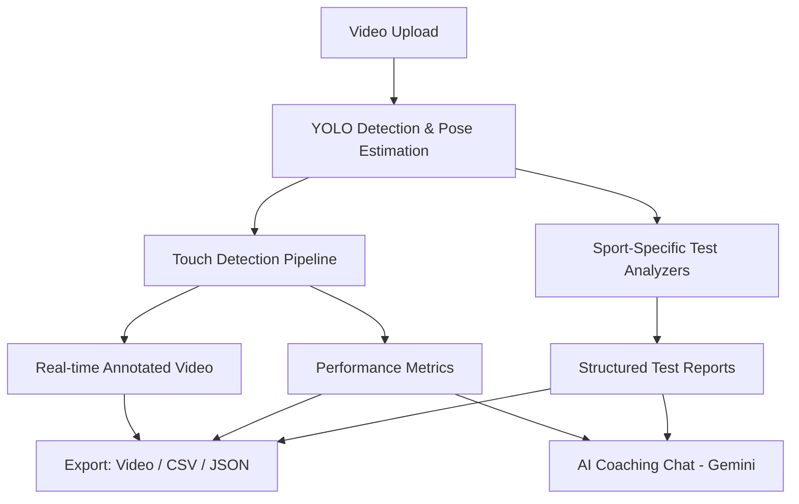
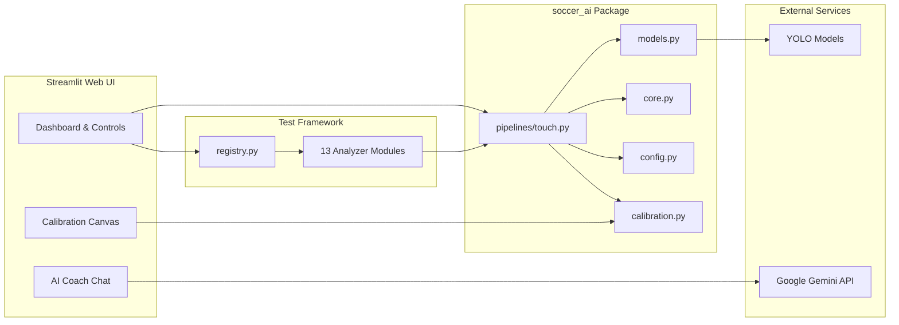
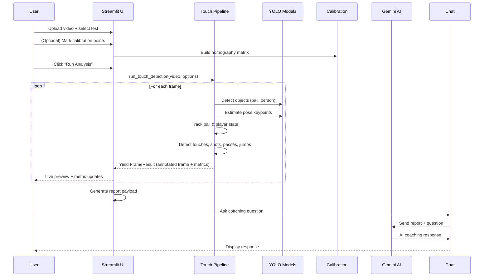

# Software Requirements Specification (SRS)

## Soccer AI — Performance Analysis Platform

| Field | Value |
|-------|-------|
| **Project Name** | Soccer AI |
| **Version** | 1.0 |
| **Date** | 2026-02-14 |
| **Author** | Naushad Vali |
| **Repository** | `soccer_ai` |

---

## Table of Contents

1. [Introduction](#1-introduction)
2. [Overall Description](#2-overall-description)
3. [System Architecture](#3-system-architecture)
4. [Functional Requirements](#4-functional-requirements)
5. [Non-Functional Requirements](#5-non-functional-requirements)
6. [External Interface Requirements](#6-external-interface-requirements)
7. [Data Requirements](#7-data-requirements)
8. [Appendices](#8-appendices)

---

## 1. Introduction

### 1.1 Purpose

This document specifies the software requirements for **Soccer AI**, an AI-powered soccer performance analysis platform. The system uses computer vision, pose estimation, and machine learning to analyze player performance from video footage and provide actionable coaching insights.

### 1.2 Scope

Soccer AI processes uploaded soccer training/match videos and produces:
- Real-time annotated video with detection overlays
- Quantitative performance metrics (speed, distance, touches, jumps, shots, passes)
- Structured test reports for 13 sport-specific assessments
- AI-powered coaching feedback via Google Gemini integration
- Exportable data (CSV, annotated video, calibration files)

### 1.3 Intended Audience

| Audience | Usage |
|----------|-------|
| Soccer coaches | Evaluate player performance using structured test reports |
| Athletes | Self-analyze training sessions and track improvement |
| Sports analysts | Extract detailed kinematics and event data |
| Developers | Extend the platform with new tests or models |

### 1.4 Definitions & Acronyms

| Term | Definition |
|------|-----------|
| **YOLO** | You Only Look Once — real-time object detection model |
| **Pose Estimation** | Detecting body keypoints (ankles, hips, shoulders, etc.) from video |
| **Homography** | A 3×3 transformation matrix mapping pixel coordinates to real-world meters |
| **Touch** | A detected contact between a player's foot and the ball |
| **CMJ** | Counter Movement Jump |
| **FPS** | Frames Per Second |
| **EMA** | Exponential Moving Average |

---

## 2. Overall Description

### 2.1 Product Perspective

Soccer AI is a standalone web application built with **Streamlit**, running locally on the user's machine. It processes video files offline using local YOLO model weights and outputs analysis results through an interactive browser-based dashboard.

### 2.2 Product Features (High-Level)



### 2.3 User Classes

| User Class | Description |
|------------|-------------|
| **Analyst** | Uploads video, configures detection parameters, runs analysis, exports results |
| **Coach** | Reviews test reports, interacts with AI coach for actionable feedback |
| **Athlete** | Views personal performance metrics and annotated video |

### 2.4 Operating Environment

| Component | Requirement |
|-----------|-------------|
| **OS** | macOS, Linux, Windows |
| **Runtime** | Python 3.10+ |
| **Browser** | Modern browser (Chrome, Firefox, Safari) for Streamlit UI |
| **GPU** | NVIDIA GPU recommended for faster YOLO inference (CPU fallback supported) |

### 2.5 Design Constraints

- All processing runs locally — no cloud inference endpoints required
- Video files must be in MP4, MOV, AVI, or MKV format
- YOLO model weights (`.pt` files) must be present locally
- Google Gemini API key required only for AI coaching chat feature

### 2.6 Dependencies

| Dependency | Version | Purpose |
|-----------|---------|---------|
| `ultralytics` | 8.4.7 | YOLO object detection & pose estimation |
| `torch` | ≥ 2.2.2 | Deep learning backend |
| `torchvision` | ≥ 0.15.0 | Vision utilities |
| `opencv-python` | 4.10.0.84 | Video I/O, image processing, homography |
| `numpy` | 1.26.4 | Numerical computation |
| `streamlit` | 1.52.2 | Web application framework |
| `streamlit-drawable-canvas` | 0.9.3 | Interactive calibration canvas |
| `pillow` | ≥ 9.0.0 | Image handling |
| `pandas` | ≥ 2.0.0 | Data manipulation & export |
| `google-genai` | latest | AI coaching via Gemini |
| `tqdm` | ≥ 4.64.0 | Progress bars |

---

## 3. System Architecture

### 3.1 Package Structure

```
soccer_ai/
├── soccer_ai/                 # Core library package
│   ├── __init__.py            # Shared utilities exports
│   ├── config.py              # Central configuration constants (147 params)
│   ├── core.py                # TrackState, ball tracking, smoothing helpers
│   ├── models.py              # YOLO model loader with caching
│   ├── calibration.py         # Homography calibration system
│   ├── options.py             # User-tunable pipeline options (TouchOptions)
│   └── pipelines/
│       └── touch.py           # Main touch-detection pipeline (generator)
├── tests/                     # Sport-specific test framework
│   ├── registry.py            # Test registry & definitions
│   ├── analyzers/             # 13 test analyzer modules
│   │   ├── base.py            # AnalysisResult dataclass
│   │   ├── agility.py
│   │   ├── ball_throw.py
│   │   ├── cmj.py
│   │   ├── dribbling.py
│   │   ├── drop_jump.py
│   │   ├── endurance.py
│   │   ├── juggling.py
│   │   ├── linear_sprint.py
│   │   ├── mobility.py
│   │   ├── passing.py
│   │   ├── side_bridge.py
│   │   ├── sprint.py
│   │   └── tapping.py
│   └── utils/                 # Shared UI & formatting utilities
├── app.py                     # Main Streamlit app (test-based UI)
├── streamlit_app.py           # Legacy Streamlit app (touch-focused)
├── yolo11m.pt                 # Detection model weights
├── yolo11n-pose.pt            # Pose estimation model weights
└── requirements.txt           # Python dependencies
```

### 3.2 Component Diagram



### 3.3 Data Flow



---

## 4. Functional Requirements

### 4.1 Video Input (FR-VID)

| ID | Requirement | Priority |
|----|-------------|----------|
| FR-VID-01 | The system shall accept video uploads in MP4, MOV, AVI, and MKV formats | High |
| FR-VID-02 | The system shall display video metadata (frame count, FPS) upon upload | Medium |
| FR-VID-03 | The system shall allow the user to clear the uploaded video and reset state | Medium |
| FR-VID-04 | The system shall allow configuring maximum frames to process (0 = full video) | Medium |

### 4.2 Object Detection (FR-DET)

| ID | Requirement | Priority |
|----|-------------|----------|
| FR-DET-01 | The system shall detect soccer balls using YOLO (class: `sports ball`) | High |
| FR-DET-02 | The system shall detect persons using YOLO (class: `person`) | High |
| FR-DET-03 | The system shall allow selecting detection and pose model weights | Medium |
| FR-DET-04 | The system shall allow tuning ball detection confidence (0.05–0.60) | Medium |
| FR-DET-05 | The system shall allow tuning detection resolution (320–1280 px) | Medium |
| FR-DET-06 | The system shall support ball hold frames (retaining last position when ball is lost) | Medium |
| FR-DET-07 | The system shall support configurable ball smoothing window (1–12 frames) | Medium |

### 4.3 Pose Estimation (FR-POSE)

| ID | Requirement | Priority |
|----|-------------|----------|
| FR-POSE-01 | The system shall extract body keypoints using YOLO pose model | High |
| FR-POSE-02 | The system shall identify left and right foot positions from ankle keypoints | High |
| FR-POSE-03 | The system shall track player identity across frames using ByteTrack | High |
| FR-POSE-04 | The system shall maintain per-player tracking state (TrackState) | High |

### 4.4 Touch Detection (FR-TOUCH)

| ID | Requirement | Priority |
|----|-------------|----------|
| FR-TOUCH-01 | The system shall detect foot-ball contacts (touches) using proximity heuristics | High |
| FR-TOUCH-02 | The system shall differentiate between left-foot and right-foot touches | High |
| FR-TOUCH-03 | The system shall enforce touch timing constraints (contact duration ≥ 0.07s, cooldown ≥ 0.25s) | High |
| FR-TOUCH-04 | The system shall support soft touch detection (shorter contact, configurable) | Medium |
| FR-TOUCH-05 | The system shall maintain per-player touch counts | High |

### 4.5 Ball Tracking & Kinematics (FR-BALL)

| ID | Requirement | Priority |
|----|-------------|----------|
| FR-BALL-01 | The system shall track ball position across frames with smoothing | High |
| FR-BALL-02 | The system shall compute ball velocity (speed and direction) per frame | High |
| FR-BALL-03 | The system shall compute ball acceleration | High |
| FR-BALL-04 | The system shall optionally display ball velocity vector overlay | Medium |
| FR-BALL-05 | The system shall optionally display ball trail (position history) | Medium |

### 4.6 Kick Classification (FR-KICK)

| ID | Requirement | Priority |
|----|-------------|----------|
| FR-KICK-01 | The system shall classify post-kick events as **shot**, **pass**, or **dribble** | High |
| FR-KICK-02 | Shot classification shall require: peak speed ≥ threshold, high acceleration spike, goal alignment | High |
| FR-KICK-03 | Pass classification shall require: moderate speed, low direction variance, ground fraction ≥ 0.6, identified receiver | High |
| FR-KICK-04 | The system shall compute shot power as a normalized score (0–100) | Medium |
| FR-KICK-05 | The system shall identify the nearest receiver player for pass events | Medium |
| FR-KICK-06 | The system shall display event overlays (SHOT/PASS/DRIBBLE) on annotated frames | Medium |

### 4.7 Player Speed & Distance (FR-SPEED)

| ID | Requirement | Priority |
|----|-------------|----------|
| FR-SPEED-01 | The system shall compute player speed in real-time (m/s or km/h) | High |
| FR-SPEED-02 | The system shall compute total distance traveled (meters) | High |
| FR-SPEED-03 | The system shall track peak acceleration and deceleration (m/s²) | Medium |
| FR-SPEED-04 | The system shall cap maximum realistic human speed at 12.0 m/s | Medium |
| FR-SPEED-05 | The system shall cap maximum realistic ball speed at 50.0 m/s | Medium |
| FR-SPEED-06 | The system shall support EMA smoothing for speed estimates | Medium |

### 4.8 Jump Detection (FR-JUMP)

| ID | Requirement | Priority |
|----|-------------|----------|
| FR-JUMP-01 | The system shall detect jumps by monitoring ankle Y-position changes | High |
| FR-JUMP-02 | The system shall compute jump height in meters (with calibration) or pixels | High |
| FR-JUMP-03 | The system shall enforce jump cooldown (6 frames min between jumps) | Medium |
| FR-JUMP-04 | The system shall track total jump count and maximum jump height | Medium |

### 4.9 Calibration System (FR-CALIB)

| ID | Requirement | Priority |
|----|-------------|----------|
| FR-CALIB-01 | The system shall allow users to mark 4 ground-plane points on a video frame | High |
| FR-CALIB-02 | The system shall compute a homography matrix from marked points | High |
| FR-CALIB-03 | The system shall convert pixel coordinates to real-world meters using homography | High |
| FR-CALIB-04 | The system shall automatically order marked points (TL → TR → BR → BL) | Medium |
| FR-CALIB-05 | The system shall allow configuring field rectangle dimensions (default: 20m × 10m) | Medium |
| FR-CALIB-06 | The system shall save/load calibration as JSON files | Medium |
| FR-CALIB-07 | The system shall render extended ground plane grid with distance markers | Low |
| FR-CALIB-08 | The system shall support uploading saved calibration files | Medium |
| FR-CALIB-09 | The system shall provide an interactive canvas (streamlit-drawable-canvas) for point marking | Medium |

### 4.10 Sport-Specific Tests (FR-TEST)

The system shall support the following 13 performance tests:

| ID | Test Name | Description | Output Matrices |
|----|-----------|-------------|-----------------|
| FR-TEST-01 | **Agility** | Rapid change of direction, balance, and control | speed_profile, split_times |
| FR-TEST-02 | **Ball Throw** | Upper-body power with release mechanics | release_velocity, trajectory, shoulder_angle |
| FR-TEST-03 | **Counter Movement Jump (CMJ)** | Explosive jump with stretch-shortening cycle | force_time, jump_height, landing_stability |
| FR-TEST-04 | **Dribbling** | Ball control under movement and direction changes | speed_profile, touch_log, touch_rate |
| FR-TEST-05 | **Drop Jump** | Reactive strength and ground contact response | ground_contact, reactive_strength, landing_force |
| FR-TEST-06 | **Endurance** | Sustained output and fatigue response over time | pace_profile, heart_rate_estimate, fatigue_index, turn_profile, turn_events |
| FR-TEST-07 | **Juggling** | Repeated ball contacts with stability and control | touch_count, control_stability, ball_height |
| FR-TEST-08 | **Linear Sprint** | Straight-line acceleration and top speed | split_times, velocity_profile, stride_length |
| FR-TEST-09 | **Mobility** | Joint range, symmetry, and movement quality | range_of_motion, joint_angles, symmetry_index |
| FR-TEST-10 | **Passing** | Ball strike accuracy and velocity | ball_speed, accuracy_map, foot_contact |
| FR-TEST-11 | **Side Bridge** | Core endurance and hip alignment stability | hold_duration, hip_alignment, stability_index |
| FR-TEST-12 | **Sprint** | Short burst acceleration and stride mechanics | acceleration_phase, top_speed, stride_frequency |
| FR-TEST-13 | **Tapping** | Rhythm, cadence, and contact consistency | contact_frequency, rhythm_consistency, impact_profile |

Each test produces an `AnalysisResult` containing: test name, status, metrics dict, matrices (DataFrames), artifacts, and processing logs.

### 4.11 AI Coaching Chat (FR-AI)

| ID | Requirement | Priority |
|----|-------------|----------|
| FR-AI-01 | The system shall integrate with Google Gemini API for AI coaching | High |
| FR-AI-02 | The system shall send the analysis report JSON as context to Gemini | High |
| FR-AI-03 | The system shall support multi-turn chat conversation with history | Medium |
| FR-AI-04 | The system shall allow configuring Gemini model, temperature, and max output tokens | Medium |
| FR-AI-05 | The system shall trim report data to fit within token limits | Medium |
| FR-AI-06 | The system shall use a soccer-specific system prompt for response quality | Medium |
| FR-AI-07 | The system shall read API key from environment variable or Streamlit secrets | Medium |

### 4.12 Results & Export (FR-EXPORT)

| ID | Requirement | Priority |
|----|-------------|----------|
| FR-EXPORT-01 | The system shall display summary metrics in a dashboard with metric cards | High |
| FR-EXPORT-02 | The system shall display shot/event log as a data table | Medium |
| FR-EXPORT-03 | The system shall display speed profile charts | Medium |
| FR-EXPORT-04 | The system shall export annotated video (MP4) with overlays | Medium |
| FR-EXPORT-05 | The system shall export speed profile as CSV | Medium |
| FR-EXPORT-06 | The system shall export split times as CSV | Medium |
| FR-EXPORT-07 | The system shall export test-specific matrices (force_time, landing_stability, etc.) as CSV | Medium |
| FR-EXPORT-08 | The system shall save analysis snapshots as images | Low |

### 4.13 User Interface (FR-UI)

| ID | Requirement | Priority |
|----|-------------|----------|
| FR-UI-01 | The system shall provide a sidebar for test selection, model selection, and detection settings | High |
| FR-UI-02 | The system shall provide a professional glassmorphism-themed dark mode UI | Medium |
| FR-UI-03 | The system shall use Inter font family from Google Fonts | Low |
| FR-UI-04 | The system shall show live preview during analysis with configurable stride and width | Medium |
| FR-UI-05 | The system shall organize results in tabbed interface (Summary, Shot Log, Speed Chart, etc.) | Medium |
| FR-UI-06 | The system shall display unit toggle (m/s & meters vs km/h & km) | Medium |
| FR-UI-07 | The system shall provide test-specific settings panels (e.g., Juggling, Ball Throw, Sprint) | Medium |

---

## 5. Non-Functional Requirements

### 5.1 Performance (NFR-PERF)

| ID | Requirement | Target |
|----|-------------|--------|
| NFR-PERF-01 | Video processing throughput | ≥ 10 FPS with GPU, ≥ 2 FPS on CPU |
| NFR-PERF-02 | YOLO model loading time | < 5 seconds (cached after first load) |
| NFR-PERF-03 | UI responsiveness during analysis | Live preview updates every Nth frame (configurable stride) |
| NFR-PERF-04 | Maximum video duration supported | Limited by available RAM and disk |

### 5.2 Reliability (NFR-REL)

| ID | Requirement |
|----|-------------|
| NFR-REL-01 | The system shall gracefully handle corrupted or unreadable video files |
| NFR-REL-02 | The system shall handle missing YOLO model weights with descriptive error messages |
| NFR-REL-03 | The system shall handle Gemini API failures without crashing |
| NFR-REL-04 | The system shall handle missing calibration gracefully (fallback to pixel-based metrics) |

### 5.3 Usability (NFR-USE)

| ID | Requirement |
|----|-------------|
| NFR-USE-01 | The system shall provide tooltips and help text for all configurable parameters |
| NFR-USE-02 | The system shall display clear progress indicators during video processing |
| NFR-USE-03 | The system shall persist settings across Streamlit reruns via session state |
| NFR-USE-04 | The system shall support drag-and-drop file upload |

### 5.4 Maintainability (NFR-MAIN)

| ID | Requirement |
|----|-------------|
| NFR-MAIN-01 | Core pipeline logic shall be framework-agnostic (reusable by CLI and Streamlit) |
| NFR-MAIN-02 | Configuration constants shall be centralized in `config.py` |
| NFR-MAIN-03 | Test analyzers shall follow a pluggable registry pattern |
| NFR-MAIN-04 | Model loading shall be cached to avoid redundant re-initialization |

### 5.5 Accuracy (NFR-ACC)

| ID | Requirement |
|----|-------------|
| NFR-ACC-01 | Minimum movement threshold (0.03m) shall prevent jitter from accumulating in distance |
| NFR-ACC-02 | Speed capping (12 m/s human, 50 m/s ball) shall filter out tracking errors |
| NFR-ACC-03 | Local scale computation (`m_per_px_at`) shall compensate for perspective distortion |
| NFR-ACC-04 | Speed tracking shall reset if player is lost for > 5 frames |

---

## 6. External Interface Requirements

### 6.1 User Interface

- **Platform**: Web browser via Streamlit (default port: 8501)
- **Layout**: Wide mode with expandable sidebar
- **Theme**: Dark glassmorphism with gradient accents (cyan `#22d3ee`, indigo `#6366f1`)

### 6.2 Hardware Interfaces

- **Camera/Video**: Reads pre-recorded video files (no live camera input)
- **GPU**: CUDA-compatible NVIDIA GPU for YOLO inference acceleration (optional)

### 6.3 Software Interfaces

| Interface | Protocol | Purpose |
|-----------|----------|---------|
| Google Gemini API | REST/SDK | AI coaching chat responses |
| YOLO (Ultralytics) | Local Python | Object detection and pose estimation |
| OpenCV | Local Python | Video I/O, homography, drawing |
| ByteTrack | Local Python | Multi-object tracking |

### 6.4 Communication Interfaces

- **Network**: Internet connection required only for Google Gemini API and Google Fonts loading
- **All video processing**: Fully offline / local

---

## 7. Data Requirements

### 7.1 Input Data

| Data | Format | Description |
|------|--------|-------------|
| Video file | MP4, MOV, AVI, MKV | Soccer training or match footage |
| Calibration file | JSON | Saved homography calibration points |
| YOLO weights | `.pt` files | Pre-trained detection and pose models |
| API key | String (env var / secrets) | Google Gemini API key |

### 7.2 Output Data

| Data | Format | Description |
|------|--------|-------------|
| Annotated video | MP4 | Video with detection overlays, event labels, stats |
| Speed profile | CSV | Per-frame speed data |
| Split times | CSV | Time to reach distance milestones |
| Test matrices | CSV | Test-specific DataFrames (force_time, landing, etc.) |
| Calibration | JSON | Homography matrix and field dimensions |
| Report payload | JSON | Full analysis report for AI coaching context |

### 7.3 Key Data Structures

| Structure | Module | Description |
|-----------|--------|-------------|
| `TrackState` | `core.py` | Per-player tracking state (touches, speed, jumps, position history) |
| `FrameResult` | `touch.py` | Per-frame annotated output with all metrics |
| `TouchOptions` | `options.py` | User-configurable pipeline parameters |
| `PlaneCalibration` | `calibration.py` | Homography matrix and field geometry |
| `BallMotionSample` | `touch.py` | Per-frame ball kinematics (position, velocity, acceleration) |
| `KickAnalysisResult` | `touch.py` | Classified kick event with kinematics |
| `AnalysisResult` | `base.py` | Test report output (metrics, matrices, logs) |
| `TestDefinition` | `registry.py` | Test metadata and analyzer function reference |

---

## 8. Appendices

### 8.1 Configuration Parameters Summary

The system exposes **147 tunable constants** in `config.py`, grouped as:

| Group | Example Parameters | Count |
|-------|--------------------|-------|
| Detection thresholds | `DET_CONF`, `POSE_CONF`, `KPT_CONF` | 3 |
| Calibration | `CALIB_RECT_WIDTH_M`, `USE_HOMOGRAPHY` | 8 |
| Touch timing | `CONTACT_SEC`, `COOLDOWN_SEC`, `SOFT_TOUCH_SEC` | 3 |
| Smoothing windows | `BALL_SMOOTHING`, `FOOT_SMOOTHING`, `PLAYER_SPEED_SMOOTHING` | 10 |
| Motion heuristics | `DIR_CHANGE_DEG`, `SPEED_GAIN_RATIO` | 15+ |
| Pass/shot classification | `PASS_MIN_SPEED_MPS`, `SHOT_MIN_SPEED_MPS` | 20+ |
| Jump detection | `JUMP_MIN_DELTA_PX`, `JUMP_MIN_AIR_FRAMES` | 10 |
| Accuracy caps | `MAX_HUMAN_SPEED_MPS`, `MIN_MOVEMENT_M` | 6 |
| Tracking | `TRACK_TTL`, `FOOT_RADIUS_RATIO` | 6 |

### 8.2 Model Weights

| Model File | Type | Size | Purpose |
|------------|------|------|---------|
| `yolo11m.pt` | YOLOv11 Medium | ~38 MB | Object detection (ball, person) |
| `yolo11n-pose.pt` | YOLOv11 Nano Pose | ~6 MB | 17-keypoint pose estimation |

### 8.3 Supported YOLO Keypoints

The pose model outputs 17 keypoints per person (COCO format):

| Index | Keypoint | Used For |
|-------|----------|----------|
| 0 | Nose | — |
| 5–6 | Shoulders | Ball throw analysis |
| 11–12 | Hips | Player height estimation |
| 13–14 | Knees | Jump detection |
| 15–16 | Ankles | Foot position, touch detection, jump height |

### 8.4 Homography Calibration Specification

- **Input**: 4 user-marked points on video frame + real-world dimensions
- **Algorithm**: OpenCV `cv2.findHomography()` (RANSAC)
- **Output**: 3×3 homography matrix mapping pixels → meters
- **Default field**: 20m × 10m rectangle
- **Point ordering**: Automatic (top-left → top-right → bottom-right → bottom-left)
- **Persistence**: JSON file with image points, field points, homography matrix, and metadata
