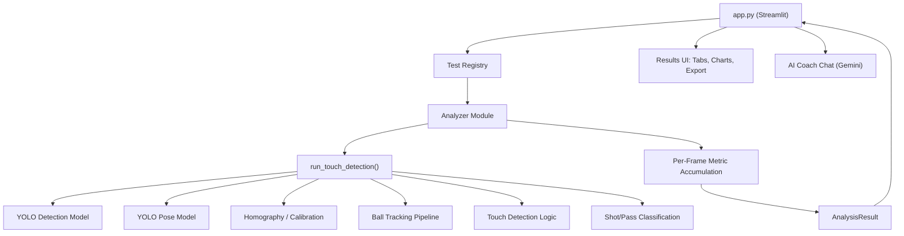

# Technical Documentation — Soccer AI

## Complete Code Flow & Test Analysis Reference

| Field | Value |
|-------|-------|
| **Entrypoint** | `app.py` |
| **Framework** | Streamlit |
| **Detection** | YOLOv11 (Ultralytics) |
| **Pose** | YOLOv11-Pose |
| **Language** | Python 3.10+ |

---

## Table of Contents

1. [High-Level Architecture](#1-high-level-architecture)
2. [Entrypoint — `app.py`](#2-entrypoint--apppy)
3. [Core Pipeline — `run_touch_detection()`](#3-core-pipeline--run_touch_detection)
4. [Test Registry & Dispatch](#4-test-registry--dispatch)
5. [Analyzer Base Class](#5-analyzer-base-class)
6. [Test 1 — Agility](#6-test-1--agility)
7. [Test 2 — Dribbling](#7-test-2--dribbling)
8. [Test 3 — Sprint](#8-test-3--sprint)
9. [Test 4 — Counter Movement Jump (CMJ)](#9-test-4--counter-movement-jump-cmj)
10. [Test 5 — Drop Jump](#10-test-5--drop-jump)
11. [Test 6 — Endurance](#11-test-6--endurance)
12. [Test 7 — Juggling](#12-test-7--juggling)
13. [Test 8 — Ball Throw](#13-test-8--ball-throw)
14. [Tests 9–13 — Stub Analyzers](#14-tests-9-13--stub-analyzers)
15. [Support Modules](#15-support-modules)
16. [Live Callback System](#16-live-callback-system)
17. [Results Rendering & Export](#17-results-rendering--export)
18. [AI Coach Chat](#18-ai-coach-chat)

---

## 1. High-Level Architecture



**Execution flow (one sentence):** The user selects a test and uploads a video in the Streamlit UI → `app.py` calls `registry.run_analysis()` → the registry dispatches to the correct analyzer module → each analyzer iterates frame-by-frame over `run_touch_detection()` (the core YOLO pipeline) → per-frame metrics are accumulated → an `AnalysisResult` (metrics + DataFrames + logs) is returned → `app.py` renders results in a tabbed interface → optional AI coaching via Google Gemini.

---

## 2. Entrypoint — `app.py`

**File:** `app.py` — 2,763 lines  
**Run command:** `streamlit run app.py`

### 2.1 Startup & Session State Initialization

When Streamlit starts, `app.py`:

1. **Injects CSS** — A glassmorphism dark theme is injected via `st.markdown()` using `<style>` tags. This includes gradient backgrounds, frosted-glass card effects, accent colors (`#00f0ff` cyan, `#ff6b35` orange), and animated metric cards.

2. **Initializes session state** — ~50 keys are initialized covering:
   - `selected_test` — currently selected test name (default: first in registry)
   - `analysis_result` / `analysis_error` — holds the result or error from the last run
   - `analysis_runtime` — a mutable `dict` shared with the analyzer for live frame records, snapshots, and shot logs
   - Model weights paths (`detector_weights`, `pose_weights`)
   - Detection tunables (`ball_detection_conf`, `ball_detection_imgsz`, `ball_hold_frames`, `ball_smoothing`)
   - Homography/calibration (`agility_use_homography`, `calibration_path`)
   - Test-specific parameters (CMJ thresholds, sprint contact ratios, ball throw release speeds, juggling gap thresholds, etc.)
   - AI coach state (`chat_messages`, `gemini_model`)

3. **Defines helper functions** for formatting:
   - `format_time()`, `format_speed()`, `format_speed_mps()`, `format_distance_m()`, `format_accel()`, `format_accel_mps2()` — all handle `None` gracefully, returning `"--"`.
   - `_chunk()` — splits lists into groups for multi-column display.

### 2.2 Sidebar Configuration

The sidebar is organized into collapsible `st.expander()` sections:

| Expander | Controls |
|----------|----------|
| **Test Selection** | `st.selectbox` listing all 13 registered tests. Shows test description. |
| **Model Weights** | File uploaders for detection and pose `.pt` files, or "Auto" default. |
| **Detection Tuning** | Confidence thresholds, image size, ball hold frames, smoothing window. |
| **Homography** | Toggle, calibration file uploader, interactive canvas for manual point picking. |
| **Jump Settings** | Min air frames, cooldown, delta thresholds, up-streak params, landing window (for CMJ & Drop Jump). |
| **Sprint Settings** | Contact ratio, cooldown frames, stride window, split distances. |
| **Ball Throw Settings** | Release speed thresholds (m/s and px/s), release window frames, ground detection params. |
| **Juggling Settings** | Gap threshold, missing ball frames, ground ratio, player height toggle, stability window. |
| **Display Settings** | Display stride, metric vs imperial, live update stride, tail rows. |

### 2.3 Video Upload & Calibration

1. **Video upload** — `st.file_uploader()` accepts `.mp4`, `.avi`, `.mov`, `.mkv`. The file is saved to a temporary path.
2. **Calibration canvas** — When homography is enabled, a `streamlit-drawable-canvas` component renders the first frame. The user clicks 4+ corresponding field points. The points are saved as a JSON calibration file.

### 2.4 Analysis Execution

When the user clicks **"▶ Run Analysis"**:

```python
analysis_settings = {
    "test_name": definition.name,
    "expected_matrices": definition.expected_matrices,
    "detector_weights": ...,
    "pose_weights": ...,
    "display_stride": ...,
    "use_homography": ...,
    "calibration_path": ...,
    "live_callback": live_callback_fn,  # Streamlit placeholder updater
    "live_stride": ...,
    "live_tail_rows": ...,
    "runtime_store": st.session_state.analysis_runtime,
    "total_frames": total_frames,
    # ... all test-specific parameters ...
}

st.session_state.analysis_result = registry.run_analysis(
    st.session_state.selected_test,
    video_path,
    analysis_settings,
)
```

The `live_callback` function is a closure that updates Streamlit placeholders with:
- The latest annotated frame (BGR → RGB conversion)
- A progress bar
- Live metric values (speed, distance, touches, etc.)
- Tail DataFrames (last N rows of time-series data)

### 2.5 Results Rendering

After analysis, results are rendered in a **7-tab interface**:

| Tab | Content |
|-----|---------|
| **Summary** | Test-specific metric cards (st.metric) — layout varies per test. |
| **Player** | Interactive frame-by-frame player with overlay controls (player boxes, IDs, feet, ball marker, trail, speed, annotations). |
| **Graph** | Primary chart (speed profile, trajectory, acceleration phase, etc.) — varies per test. |
| **Speed/Rate** | Secondary chart (touch rate, stride frequency, shoulder angles, etc.) — varies per test. |
| **Snapshots** | Key-moment captures (touch events, speed peaks, release frames). |
| **Export** | CSV/JSON download of metrics and DataFrames. Report payload builder. |
| **Coach Chat** | Google Gemini AI integration for coaching insights. |

---

## 3. Core Pipeline — `run_touch_detection()`

**File:** `soccer_ai/pipelines/touch.py` — 2,113 lines  
**Entry:** `run_touch_detection(video_path, options, max_frames)` → yields `FrameResult` objects

This is the **central engine** that every test analyzer calls. It is a **generator function** that processes video frame-by-frame and yields rich per-frame results.

### 3.1 Pipeline Initialization

```python
def run_touch_detection(video_path, options=None, max_frames=None):
```

1. **Load YOLO models:**
   - Detection model (`YOLO(options.detector_weights)`) — detects ball + person classes
   - Pose model (`YOLO(options.pose_weights)`) — estimates 17 COCO keypoints per person

2. **Open video** via `cv2.VideoCapture()`
3. **Load calibration** (if path provided) → deserialize homography matrix from JSON
4. **Initialize trackers:**
   - `BallTracker` — Kalman-filter-based ball position/velocity tracker
   - `PersonTracker` — multi-person tracker with ID assignment
   - `TouchDetector` — proximity-based foot-ball contact detection
   - `ShotClassifier` — classifies kicks as shot vs pass based on ball trajectory statistics

### 3.2 Per-Frame Processing

For each frame, the pipeline:

```
1. Read frame from cv2.VideoCapture
2. Run YOLO detection model → bounding boxes for ball + persons
3. Run YOLO pose model → 17 keypoints per person (nose, eyes, ears, shoulders, elbows, wrists, hips, knees, ankles)
4. Update BallTracker (Kalman filter predict/update)
   - Compute ball speed (px/s and m/s if homography available)
   - Compute ball direction vector
   - Apply smoothing (moving median over N frames)
5. Update PersonTracker
   - Track person IDs across frames (IoU-based assignment)
   - Extract ankle positions ("left" / "right" from keypoints 15/16)
   - Compute per-person speed via ankle displacement
6. Run TouchDetector
   - For each person, check foot-ball proximity
   - If foot-ball distance < threshold → register touch (left or right)
   - Maintain cumulative touch counts
7. Run ShotClassifier (after touch detection)
   - Analyze ball trajectory after a touch event
   - Classify as "shot" or "pass" based on:
     - Ball speed (avg, peak)
     - Direction change (standard deviation of direction)
     - Ground fraction (how long ball stays near ground)
     - Target player (is ball heading toward another person?)
8. Compute homography-based field coordinates (if enabled)
   - Transform pixel coordinates → real-world meters using H matrix
   - Compute total distance traveled, speed in m/s
9. Detect jumps (if enabled)
   - Track ankle Y position relative to ground baseline
   - Detect airborne phases where ankle delta exceeds threshold
10. Annotate frame
    - Draw bounding boxes, keypoints, ball marker, speed vectors
    - Add text overlays for metrics
11. Yield FrameResult
```

### 3.3 `FrameResult` Object

Each yielded result contains:

| Field | Type | Description |
|-------|------|-------------|
| `frame_idx` | `int` | 0-based frame number |
| `annotated` | `np.ndarray` (BGR) | Annotated frame image |
| `left_touches` | `int` | Cumulative left-foot touches |
| `right_touches` | `int` | Cumulative right-foot touches |
| `avg_speed_kmh` | `Optional[float]` | Running average speed in km/h |
| `max_speed_kmh` | `Optional[float]` | Peak speed seen so far |
| `total_time_sec` | `Optional[float]` | Elapsed time in seconds |
| `total_distance_m` | `Optional[float]` | Total distance covered (homography required) |
| `peak_accel_mps2` | `Optional[float]` | Peak acceleration |
| `peak_decel_mps2` | `Optional[float]` | Peak deceleration |
| `total_jumps` | `Optional[int]` | Total jumps detected |
| `highest_jump_m` | `Optional[float]` | Highest jump in meters |
| `highest_jump_px` | `Optional[float]` | Highest jump in pixels |
| `shot_events` | `Optional[List]` | Classified kick events (shots/passes) |
| `frame_meta` | `dict` | Raw metadata: `{"players": [...], "ball": {...}, ...}` |

### 3.4 Key Data Structures in `frame_meta`

**`frame_meta["players"]`** — list of dicts, each:
```python
{
    "id": 1,
    "bbox": [x1, y1, x2, y2],
    "left": (ankle_x, ankle_y),       # left ankle keypoint
    "right": (ankle_x, ankle_y),      # right ankle keypoint
    "left_wrist": (x, y),             # left wrist keypoint
    "right_wrist": (x, y),            # right wrist keypoint
    "left_shoulder": (x, y),
    "right_shoulder": (x, y),
    "left_elbow": (x, y),
    "right_elbow": (x, y),
    "left_field": (mx, my),           # real-world coords (if homography)
    "right_field": (mx, my),
    "bbox_field": (mx, my),
    "speed_kmh": float,
}
```

**`frame_meta["ball"]`** — dict:
```python
{
    "center": (x, y),
    "bbox": [x1, y1, x2, y2],
    "speed_mps": float,
    "speed_draw": float,   # speed in px/s
    "direction": (dx, dy),
}
```

---

## 4. Test Registry & Dispatch

**File:** `tests/registry.py`

### 4.1 TestDefinition

```python
@dataclass(frozen=True)
class TestDefinition:
    name: str
    description: str
    expected_matrices: List[str]
    analyze_fn: Callable[[str, dict], AnalysisResult]
```

### 4.2 Registered Tests

The registry defines **13 tests**, each mapped to an `analyze()` function:

| # | Name | Analyzer Module | Status | Expected Matrices |
|---|------|----------------|--------|-------------------|
| 1 | Agility | `agility.py` | ✅ Full | `speed_profile`, `split_times` |
| 2 | Dribbling | `dribbling.py` | ✅ Full | `speed_profile`, `touch_log`, `touch_rate` |
| 3 | Sprint | `sprint.py` | ✅ Full | `acceleration_phase`, `top_speed`, `stride_frequency`, `speed_profile`, `split_times` |
| 4 | CMJ | `cmj.py` | ✅ Full | `force_time`, `jump_height`, `landing_stability` |
| 5 | Drop Jump | `drop_jump.py` | ✅ Full | `ground_contact`, `reactive_strength`, `landing_force` |
| 6 | Endurance | `endurance.py` | ✅ Full | `speed_profile`, `pace_profile`, `heart_rate_estimate`, `fatigue_index`, `turn_profile`, `turn_events`, `split_times` |
| 7 | Juggling | `juggling.py` | ✅ Full | `touch_count`, `control_stability`, `ball_height` |
| 8 | Ball Throw | `ball_throw.py` | ✅ Full | `release_velocity`, `trajectory`, `shoulder_angle` |
| 9 | Linear Sprint | `linear_sprint.py` | 🔲 Stub | `speed_profile`, `split_times` |
| 10 | Mobility | `mobility.py` | 🔲 Stub | `range_of_motion` |
| 11 | Passing | `passing.py` | 🔲 Stub | `pass_accuracy`, `pass_log` |
| 12 | Side Bridge | `side_bridge.py` | 🔲 Stub | `hold_time`, `stability` |
| 13 | Tapping | `tapping.py` | 🔲 Stub | `tap_count`, `tap_rate` |

### 4.3 Dispatch

```python
def run_analysis(test_name: str, video_path: str, settings: dict) -> AnalysisResult:
    definition = TESTS[test_name]
    return definition.analyze_fn(video_path, settings)
```

---

## 5. Analyzer Base Class

**File:** `tests/analyzers/base.py`

### 5.1 `AnalysisResult`

```python
@dataclass
class AnalysisResult:
    test_name: str                           # e.g. "Agility"
    status: str                              # "ok", "fallback", "error"
    metrics: Dict[str, float | int | str]    # scalar results
    matrices: Dict[str, pd.DataFrame]        # tabular results
    artifacts: Dict[str, str]                # file paths (snapshots, etc.)
    logs: List[str]                          # human-readable log lines
```

### 5.2 `build_dummy_result()`

When OpenCV is unavailable or analysis fails, all analyzers call this to generate a placeholder:

```python
def build_dummy_result(test_name, expected_matrices, settings) -> AnalysisResult:
    # Uses a deterministic seed from test_name
    # Generates random but reproducible metrics and DataFrames
    # Status = "placeholder"
```

This ensures the UI always has data to render, even in error cases.

---

## 6. Test 1 — Agility

**File:** `tests/analyzers/agility.py` — 462 lines  
**Purpose:** Measure an athlete's agility via speed, distance, acceleration, and split times.

### 6.1 Algorithm

```
1. Configure TouchOptions from settings
2. Read video FPS
3. Iterate over run_touch_detection():
   For each frame:
   a. Extract time_s, avg_speed (km/h → m/s), max_speed, total_distance
   b. Compute acceleration = Δspeed / Δtime
   c. Track peak acceleration and peak deceleration
   d. Accumulate time_series, distance_series, speed_series, accel_series
   e. Every live_stride frames → call live_callback with:
      - Speed profile tail (last N rows)
      - Current metrics snapshot
      - Progress percentage
   f. Store frame records in runtime_store for Player tab
   g. Capture snapshots: at speed peaks (when speed exceeds previous best + 0.5 m/s)
4. After iteration:
   - Compute final metrics from last_result
   - Build split_times DataFrame: for each target distance (5, 10, 20, 30m),
     find the first frame where distance_m >= target
   - Build speed_profile DataFrame (full time-series)
5. Return AnalysisResult
```

### 6.2 Output Metrics

| Metric | Unit | Description |
|--------|------|-------------|
| `total_time_s` | seconds | Total analysis duration |
| `total_distance_m` | meters | Total distance covered |
| `avg_speed_mps` | m/s | Average speed |
| `max_speed_mps` | m/s | Peak speed |
| `peak_accel_mps2` | m/s² | Maximum acceleration |
| `peak_decel_mps2` | m/s² | Maximum deceleration |

### 6.3 Output DataFrames

- **`speed_profile`** — columns: `time_s`, `avg_speed_mps`, `max_speed_mps`, `accel_mps2`, `distance_m`
- **`split_times`** — columns: `distance_m`, `time_s`

---

## 7. Test 2 — Dribbling

**File:** `tests/analyzers/dribbling.py` — 481 lines  
**Purpose:** Analyze dribbling performance: ball touches, touch frequency, speed, and ball control quality.

### 7.1 Algorithm

```
1. Same pipeline setup as Agility
2. Iterate over run_touch_detection():
   For each frame:
   a. Extract speed/distance (same as Agility)
   b. Track touch events:
      - delta_left = left_touches - prev_left (new left touches this frame)
      - delta_right = right_touches - prev_right
      - For each new touch: record {frame_idx, time_s, foot, total/left/right counts}
   c. Compute touch_rate using SLIDING WINDOW:
      - Maintain a window of touch timestamps within last touch_window_seconds (default 2s)
      - touch_rate = len(window) / touch_window_seconds
   d. Capture snapshots:
      - On touch events (with 8-frame cooldown between snapshots)
      - On speed peaks (when speed > previous best + 0.5 m/s)
3. After iteration:
   - Compute: touches_per_min = total_touches / total_time * 60
   - Compute: touches_per_meter = total_touches / total_distance
   - Build DataFrames: speed_profile, touch_log, touch_rate
4. Return AnalysisResult
```

### 7.2 Output Metrics

| Metric | Unit | Description |
|--------|------|-------------|
| `touch_count` | count | Total ball touches |
| `left_touches` | count | Left foot touches |
| `right_touches` | count | Right foot touches |
| `touches_per_min` | touches/min | Touch frequency |
| `touches_per_meter` | touches/m | Touch density |
| `avg_speed_mps` | m/s | Average dribbling speed |
| `max_speed_mps` | m/s | Peak dribbling speed |
| `peak_accel_mps2` | m/s² | Peak acceleration |
| `peak_decel_mps2` | m/s² | Peak deceleration |

### 7.3 Output DataFrames

- **`speed_profile`** — same as Agility + `touch_rate`, `touch_count` columns
- **`touch_log`** — columns: `frame_idx`, `time_s`, `foot`, `total_touches`, `left_touches`, `right_touches`
- **`touch_rate`** — columns: `time_s`, `touch_rate`, `touch_count`

---

## 8. Test 3 — Sprint

**File:** `tests/analyzers/sprint.py` — 507 lines  
**Purpose:** Analyze sprint performance with stride analysis, acceleration profiling, and split times.

### 8.1 Algorithm

```
1. Pipeline setup (same pattern)
2. Configure sprint-specific params:
   - contact_ratio = 0.9 (ankle-Y / bbox-height threshold for ground contact)
   - contact_cooldown = 6 frames
   - stride_window_s = 1.0 seconds
   - split_distances = [5, 10, 20, 30] meters
3. Iterate over run_touch_detection():
   For each frame:
   a. Compute speed, acceleration, distance (standard)
   b. STRIDE DETECTION:
      - Select main player (largest bounding box)
      - For each foot (left, right ankle from pose):
        - Normalize ankle Y relative to bbox: left_norm = (ankle_y - bbox_y1) / bbox_height
        - If normalized Y >= contact_ratio → foot is touching ground
        - Register ground contact event (with cooldown between events)
   c. STEP/STRIDE RATE:
      - Over a sliding window of stride_window_s seconds:
        - step_rate = number of ground contacts in window / window duration
        - stride_rate = step_rate / 2.0 (two steps = one stride)
   d. Time-to-speed markers:
      - Track when speed first reaches 90% and 95% of eventual max speed
4. After iteration:
   - Build split_times: for each distance target, find the time when distance_m >= target
   - Build DataFrames: acceleration_phase, top_speed, stride_frequency, speed_profile, split_times
5. Return AnalysisResult
```

### 8.2 Output Metrics

| Metric | Unit | Description |
|--------|------|-------------|
| `total_time_s` | s | Duration |
| `total_distance_m` | m | Distance |
| `avg_speed_mps` | m/s | Average speed |
| `max_speed_mps` | m/s | Top speed |
| `peak_accel_mps2` | m/s² | Peak acceleration |
| `peak_decel_mps2` | m/s² | Peak deceleration |
| `time_to_90_pct_s` | s | Time to reach 90% of top speed |
| `time_to_95_pct_s` | s | Time to reach 95% of top speed |
| `avg_step_rate_hz` | Hz | Average step frequency |
| `avg_stride_rate_hz` | Hz | Average stride frequency |

### 8.3 Output DataFrames

- **`acceleration_phase`** — columns: `time_s`, `speed_mps`, `accel_mps2`, `pct_top_speed`
- **`top_speed`** — single row: `top_speed_mps`, `time_to_90_pct_s`, `time_to_95_pct_s`, `avg_step_rate_hz`, `avg_stride_rate_hz`
- **`stride_frequency`** — columns: `time_s`, `step_rate_hz`, `stride_rate_hz`
- **`speed_profile`** — columns: `time_s`, `speed_mps`, `accel_mps2`, `distance_m`
- **`split_times`** — columns: `distance_m`, `time_s`

---

## 9. Test 4 — Counter Movement Jump (CMJ)

**File:** `tests/analyzers/cmj.py` — 602 lines  
**Purpose:** Detect and analyze vertical jumps using ankle position tracking, measuring jump height, flight time, and landing stability.

### 9.1 Algorithm

This is the most complex pure-vision jump detection algorithm in the codebase:

```
HEIGHT ESTIMATION:
  1. Select main player (largest bbox)
  2. Extract ankle positions (left/right from pose keypoints)
  3. Estimate meters_per_pixel = PLAYER_REF_HEIGHT_M / bbox_height
     (assumes athlete is ~1.75m tall; smoothed via median of recent values)
  4. Maintain ground_ankle_history (deque of ankle Y values when on ground)
  5. ground_y = median(ground_ankle_history)
  6. ankle_delta_px = ground_y - current_ankle_y (positive = above ground)
  7. height_m = ankle_delta_px × meters_per_pixel

JUMP DETECTION STATE MACHINE:
  threshold = max(
      min_delta_px,                        # absolute minimum (default 6px)
      hip_ankle_distance × delta_ratio,    # proportion of body height
      noise_px × NOISE_SCALE + MARGIN      # adaptive noise floor
  )
  end_threshold = threshold × end_ratio

  States: NOT_JUMPING / JUMPING

  NOT_JUMPING → JUMPING:
    - ankle_delta_px >= threshold for min_air_frames consecutive frames
    - OR upward velocity streak >= up_streak_req frames
    - AND cooldown since last jump has elapsed

  JUMPING → NOT_JUMPING:
    - ankle_delta_px <= end_threshold
    - AND frame count since jump start >= min_air_frames
    - Record: jump_id, start/end frame, start/end time, flight_time, peak_height

LANDING STABILITY:
  After each jump ends:
  - Collect ankle_y values for landing_window_frames (default 8)
  - landing_std_px = std(ankle_y samples)
  - stability_score = 1.0 / (1.0 + landing_std_px)
    (higher = more stable landing; 1.0 = perfectly still)

FORCE-TIME PROXY:
  - vel_px_s = Δheight_px / Δtime
  - vel_mps = Δheight_m / Δtime
  - accel_px_s2 = Δvel_px_s / Δtime
  - accel_mps2 = Δvel_mps / Δtime
  - force_proxy = accel_mps2 (or accel_px_s2 if no scale)
```

### 9.2 Output Metrics

| Metric | Unit | Description |
|--------|------|-------------|
| `total_jumps` | count | Total jumps detected |
| `highest_jump_m` | m | Best jump height (meters) |
| `highest_jump_px` | px | Best jump height (pixels) |
| `avg_jump_height_m` | m | Average jump height |
| `avg_flight_time_s` | s | Average time in air |
| `avg_landing_stability` | 0–1 | Average landing stability score |
| `best_landing_stability` | 0–1 | Best landing stability score |

### 9.3 Output DataFrames

- **`force_time`** — columns: `time_s`, `frame_idx`, `height_px`, `height_m`, `vel_px_s`, `vel_mps`, `accel_px_s2`, `accel_mps2`, `force_proxy`
- **`jump_height`** — columns: `time_s`, `frame_idx`, `height_px`, `height_m`, `height_ratio`, `jump_active`, `jump_id`
- **`landing_stability`** — columns: `jump_id`, `frame_idx`, `time_s`, `landing_std_px`, `landing_std_m`, `stability_score`

---

## 10. Test 5 — Drop Jump

**File:** `tests/analyzers/drop_jump.py` — 747 lines  
**Purpose:** Analyze reactive strength via drop-jump protocol. Measures contact time, flight time, jump height, and Reactive Strength Index (RSI).

### 10.1 Algorithm

This test uses a **4-phase state machine** with EMA-smoothed ankle velocity:

```
SIGNAL PROCESSING:
  1. Extract lower foot Y position: y = max(left_ankle_y, right_ankle_y)
  2. EMA smooth: y_s = α × y + (1-α) × y_s_prev  (α = 0.25)
  3. Compute velocity: v_px_s = (y_s - prev_y) / dt  (positive = downward)
  4. Normalize: v_norm = v_px_s / bbox_height  (scale-invariant; units: 1/s)
  5. EMA smooth v_norm

PHASE STATE MACHINE:

  ┌──────────────┐
  │  SEEK_DROP   │ → Wait for athlete to fall off the box
  └──────┬───────┘
         │ v_norm > drop_vel_norm_min for drop_frames
         │ OR drop_delta_px exceeds threshold
         ▼
  ┌──────────────┐
  │ SEEK_LANDING │ → Athlete is falling; wait for ground contact
  └──────┬───────┘
         │ descend phase seen + velocity stabilizes (still_streak)
         │ OR velocity sign changes (+ → -)
         ▼
  ┌──────────────┐
  │   CONTACT    │ → Athlete on ground; measure contact duration
  └──────┬───────┘
         │ Upward velocity detected (up_streak >= up_frames)
         │ Record: contact_time = takeoff_time - landing_time
         │ PLAUSIBILITY CHECK: min_contact_s ≤ ct ≤ max_contact_s
         ▼
  ┌──────────────┐
  │   FLIGHT     │ → Athlete is airborne; track apex
  └──────┬───────┘
         │ Descend seen + velocity stabilizes → second landing
         │ flight_time = second_landing_time - takeoff_time
         │ jump_height = g × t² / 8  (flight-time method)
         │ RSI = jump_height / contact_time
         │ PLAUSIBILITY CHECK: min_flight_s ≤ ft ≤ max_flight_s
         ▼
  ┌──────────────┐
  │  SEEK_DROP   │ → Reset for next repetition
  └──────────────┘

TUNABLE PARAMETERS:
  - drop_vel_norm_min = 0.55 (falling speed threshold)
  - takeoff_vel_norm_min = 0.45 (upward movement threshold)
  - contact_vel_norm_max = 0.20 ("still" band defining ground contact)
  - drop_frames = ~2 frames (at 30fps)
  - still_frames = ~2 frames
  - up_frames = ~2 frames
  - min/max contact_s = [0.05, 1.20]
  - min/max flight_s = [0.08, 1.50]
  - gravity = 9.80665 m/s²
```

### 10.2 Output Metrics

| Metric | Unit | Description |
|--------|------|-------------|
| `total_jumps` | count | Drop jumps detected |
| `last_contact_time_s` | s | Most recent contact time |
| `last_jump_height_m` | m | Most recent jump height |
| `last_rsi` | m/s | Most recent RSI |
| `best_jump_height_m` | m | Best jump height |
| `best_rsi` | m/s | Best RSI (higher = better reactive strength) |
| `best_contact_time_s` | s | Shortest ground contact |
| `avg_contact_time_s` | s | Mean contact time |
| `avg_jump_height_m` | m | Mean jump height |
| `avg_rsi` | m/s | Mean RSI |

### 10.3 Output DataFrames

- **`ground_contact`** — columns: `jump_id`, `contact_start_frame`, `contact_end_frame`, `contact_time_s`, `impact_velocity_px_s`, `impact_velocity_mps`, `peak_accel_px_s2`, `peak_accel_mps2`
- **`reactive_strength`** — columns: `jump_id`, `contact_time_s`, `flight_time_s`, `jump_height_px`, `jump_height_m`, `rsi`
- **`landing_force`** — columns: `jump_id`, `impact_velocity_px_s`, `impact_velocity_mps`, `peak_accel_px_s2`, `peak_accel_mps2`

---

## 11. Test 6 — Endurance

**File:** `tests/analyzers/endurance.py` — 684 lines  
**Purpose:** Long-duration endurance analysis with turn detection, estimated heart rate, pace tracking, and fatigue index.

### 11.1 Algorithm

```
STANDARD MOTION TRACKING (speed, distance, acceleration):
  Same as Agility

TURN DETECTION:
  1. Compute player position:
     - Prefer field coordinates (homography) if available
     - Fallback to pixel coordinates (ankle midpoint or bbox bottom-center)
  2. Compute heading = atan2(Δy, Δx) when move_dist >= min_move threshold
  3. Compute turn_angle = angle_diff_deg(current_heading, previous_heading)
  4. If turn_angle >= min_turn_angle (default 45°) AND gap since last turn >= min_turn_gap_s (0.8s):
     → Register turn event with: angle, rate (°/s), position, heading

ESTIMATED HEART RATE:
  - Simple linear model: HR = min_hr + (max_hr - min_hr) × effort
  - effort = speed / ref_speed, clamped to [0, 1.2]
  - Default: min_hr=90bpm, max_hr=190bpm, ref_speed=7 m/s

FATIGUE INDEX:
  1. Collect first N speed samples as baseline_speed (default N=10)
  2. Maintain rolling_speed over a sliding window (default 10s)
  3. fatigue_index = 1.0 - (rolling_speed / baseline_speed), clamped to [0, 1]
  4. fatigue_index = 0 means no fatigue; 1 means complete speed collapse

PACE:
  pace_s_per_km = 1000 / speed_mps
  pace_min_per_km = pace_s_per_km / 60

SPLIT TIMES:
  At 25%, 50%, 75%, 100% of total distance
```

### 11.2 Output Metrics

| Metric | Unit | Description |
|--------|------|-------------|
| Standard speed/distance/accel metrics | — | Same as Agility |
| `total_turns` | count | Direction changes ≥ 45° |
| `turns_per_min` | turns/min | Turn frequency |
| `avg_turn_angle_deg` | ° | Mean turn angle |
| `max_turn_angle_deg` | ° | Sharpest turn |
| `avg_turn_rate_deg_s` | °/s | Mean turn rate |
| `max_turn_rate_deg_s` | °/s | Fastest turn |
| `avg_heart_rate_bpm` | bpm | Estimated HR average |
| `max_heart_rate_bpm` | bpm | Estimated HR peak |
| `fatigue_index` | 0–1 | End-of-test fatigue level |
| `avg_pace_s_per_km` | s/km | Average pace |
| `avg_pace_min_per_km` | min/km | Average pace (minutes) |

### 11.3 Output DataFrames

- **`speed_profile`** — standard speed/distance time series
- **`pace_profile`** — `time_s`, `distance_m`, `speed_mps`, `pace_s_per_km`, `pace_min_per_km`, `rolling_speed_mps`
- **`heart_rate_estimate`** — `time_s`, `heart_rate_bpm`
- **`fatigue_index`** — `time_s`, `fatigue_score`, `rolling_speed_mps`, `baseline_speed_mps`
- **`turn_profile`** — `time_s`, `heading_deg`, `turn_rate_deg_s`, `turn_angle_deg`, `turns`, `pos_x`, `pos_y`
- **`turn_events`** — per-turn: `turn_id`, `time_s`, `turn_angle_deg`, `turn_rate_deg_s`, `heading_deg`, `pos_x`, `pos_y`, `pos_unit`
- **`split_times`** — `segment`, `distance_m`, `time_s`, `segment_time_s`

---

## 12. Test 7 — Juggling

**File:** `tests/analyzers/juggling.py` — 540 lines  
**Purpose:** Evaluate ball juggling skill by tracking consecutive touches, touch rhythm consistency, and ball height control.

### 12.1 Algorithm

```
BALL HEIGHT TRACKING:
  1. From frame_meta, get ball center position
  2. height_norm = 1.0 - (ball_y / frame_height)  (image Y-axis inverted)
  3. If use_player_height:
     - player_height = median bbox height of all players
     - ground_y = max bbox bottom-Y among all players
     - height_ratio = (ground_y - ball_y) / player_height
     - Use height_ratio as "height_proxy" (scale-invariant)
  4. Else: use height_norm as proxy

CONTROL LOSS DETECTION:
  - Ball missing for >= missing_ball_frames (default 10) → control_lost = True
  - Ball at ground level for >= ground_hold_frames (default 3):
    - ground_hit = (height_ratio <= min_height_ratio) or (ball_y_norm >= ground_ratio)
    → control_lost = True

STREAK TRACKING:
  For each new touch:
  1. Check for streak break:
     - control_lost = True, OR
     - time since last touch > gap_threshold (default 1s)
  2. If streak broken: increment drop_count, reset current_streak to 0
  3. Increment current_streak
  4. Update max_streak

STABILITY SCORING:
  - interval_std = std(last N touch intervals)  (N = stability_window, default 10)
  - stability_score = 1.0 / (1.0 + interval_std)
  - Higher = more consistent rhythm

SNAPSHOT CAPTURE:
  - Capture frame when current_streak exceeds previous best
```

### 12.2 Output Metrics

| Metric | Unit | Description |
|--------|------|-------------|
| `touch_count` | count | Total touches |
| `left_touches` | count | Left foot |
| `right_touches` | count | Right foot |
| `max_consecutive_touches` | count | Longest streak without drop |
| `avg_touch_interval_s` | s | Average time between touches |
| `touches_per_min` | touches/min | Touch frequency |
| `drop_count` | count | Number of streak breaks |
| `stability_score` | 0–1 | Overall rhythm consistency |
| `avg_ball_height` | ratio | Average ball height (player-height normalized) |
| `max_ball_height` | ratio | Peak ball height |

### 12.3 Output DataFrames

- **`touch_count`** — per-touch: `frame_idx`, `time_s`, `foot`, `total_touches`, `left/right_touches`, `streak_len`, `touch_interval_s`, `streak_break`
- **`control_stability`** — per-touch: `time_s`, `touch_interval_s`, `interval_std`, `height_var`, `stability_score`
- **`ball_height`** — per-frame: `time_s`, `ball_y_norm`, `height_norm`, `height_ratio`, `ground_y_norm`, `height_proxy`, `source`

---

## 13. Test 8 — Ball Throw

**File:** `tests/analyzers/ball_throw.py` — 749 lines  
**Purpose:** Analyze ball throw biomechanics: release speed, release angle, throw distance, shoulder/arm angles, and hand force.

### 13.1 Algorithm

```
BALL SPEED TRACKING:
  1. Primary: use speed_mps / speed_px from frame_meta["ball"]
  2. Fallback: compute from Δball_center / Δtime
  3. Smoothing: median of last 3 values

RELEASE DETECTION:
  - Monitor smoothed ball speed
  - Release triggered when:
    speed_for_release >= threshold AND
    prev_speed_for_release < threshold
  - threshold = release_speed_mps (default 3 m/s) if metric available, else release_speed_px (120 px/s)
  - After release detected, open a "release_window" of N frames to collect max values

RELEASE ANGLE:
  - From the release point, compute angle to next ball position:
    release_angle = atan2(-(ball2_y - ball1_y), ball2_x - ball1_x) × 180/π
  - Positive = upward angle

THROW DISTANCE:
  - Detect ground contact: ball at ground level for ground_hold_frames
  - throw_distance_px = distance(release_foot_position, ground_contact_position)
  - throw_distance_m = throw_distance_px × meters_per_pixel

HAND FORCE:
  - Track wrist position closest to ball (left or right wrist)
  - wrist_speed = Δwrist_position / Δtime
  - wrist_accel = Δwrist_speed / Δtime
  - hand_force = max(|wrist_accel|) during release window
  - Available in both px/s² and m/s² (if scale available)

SHOULDER ANGLE:
  - shoulder_line_angle = angle(left_shoulder → right_shoulder)
  - left_arm_angle = angle(left_shoulder → left_elbow)
  - right_arm_angle = angle(right_shoulder → right_elbow)
  - dominant_arm_angle = arm of the raised wrist (lower Y = higher)

SNAPSHOT CAPTURE:
  - Release frame (first speed spike)
  - Peak height frame (maximum ball height_proxy)
```

### 13.2 Output Metrics

| Metric | Unit | Description |
|--------|------|-------------|
| `release_speed_mps` | m/s | Ball speed at release |
| `release_speed_px_s` | px/s | Ball speed at release (pixel-space) |
| `release_angle_deg` | ° | Launch angle |
| `max_ball_height` | ratio | Peak ball height (player-height normalized) |
| `hand_force_mps2` | m/s² | Peak wrist acceleration during throw |
| `throw_distance_m` | m | Throw distance (release foot → landing) |
| `throw_distance_px` | px | Throw distance in pixels |
| `ball_detected_frames` | count | Frames where ball was detected |
| `ball_detection_rate` | 0–1 | Ball detection coverage |

### 13.3 Output DataFrames

- **`release_velocity`** — per-release: `time_s`, `frame_idx`, `release_speed_mps`, `release_speed_px_s`, `release_angle_deg`, `height_proxy`, `hand_force_mps2`, `hand_force_px_s2`, `throw_distance_m`, `throw_distance_px`
- **`trajectory`** — per-frame: `time_s`, `frame_idx`, `ball_x`, `ball_y`, `x_norm`, `y_norm`, `height_proxy`, `speed_mps`, `speed_px_s`, `is_release`, `is_ground_contact`
- **`shoulder_angle`** — per-frame: `time_s`, `left_arm_angle_deg`, `right_arm_angle_deg`, `shoulder_line_angle_deg`, `dominant_arm_angle_deg`

---

## 14. Tests 9–13 — Stub Analyzers

Five tests are registered in the registry but their analyzer modules contain only `build_dummy_result()` calls:

| # | Test | File | Status |
|---|------|------|--------|
| 9 | Linear Sprint | `linear_sprint.py` | Placeholder — returns random data |
| 10 | Mobility | `mobility.py` | Placeholder — returns random data |
| 11 | Passing | `passing.py` | Placeholder — returns random data |
| 12 | Side Bridge | `side_bridge.py` | Placeholder — returns random data |
| 13 | Tapping | `tapping.py` | Placeholder — returns random data |

Each stub file is ~12 lines:
```python
from .base import AnalysisResult, build_dummy_result

def analyze(video_path: str, settings: dict) -> AnalysisResult:
    return build_dummy_result(
        settings.get("test_name", "..."),
        settings.get("expected_matrices", []),
        settings,
    )
```

---

## 15. Support Modules

### 15.1 `soccer_ai/config.py`

147+ configuration constants including:

| Category | Examples |
|----------|----------|
| Model weights | `DETECTOR_WEIGHTS`, `POSE_WEIGHTS` |
| Detection | `DET_CONF`, `DET_IOU`, `BALL_HOLD_FRAMES`, `BALL_SMOOTHING` |
| Homography | `USE_HOMOGRAPHY`, `PLAYER_REF_HEIGHT_M` (1.75m) |
| Jump detection | `JUMP_MIN_AIR_FRAMES`, `JUMP_COOLDOWN_FRAMES`, `JUMP_MIN_DELTA_PX`, `JUMP_DELTA_RATIO`, `JUMP_END_RATIO`, `JUMP_UP_PX_PER_FRAME`, `JUMP_UP_STREAK`, `JUMP_GROUND_WINDOW`, `JUMP_NOISE_SCALE`, `JUMP_NOISE_MARGIN_PX`, `HIP_TO_ANKLE_RATIO` |
| Ball tracking | `BALL_TRAIL_MAX_GAP_FRAMES` |
| Speed/acceleration | Various thresholds |

### 15.2 `soccer_ai/options.py`

```python
@dataclass
class TouchOptions:
    detector_weights: str
    pose_weights: str
    display_stride: int = 1
    use_homography: bool = False
    calibration_path: Optional[str] = None
    ball_conf: float = 0.25
    person_conf: float = 0.25
    det_imgsz: Optional[int] = None
    ball_hold_frames: Optional[int] = None
    ball_smoothing: Optional[int] = None
```

### 15.3 `soccer_ai/core.py`

Utility functions:
- `angle_diff_deg(a, b)` — compute signed angle difference in degrees
- Math helpers used by multiple modules

### 15.4 `soccer_ai/calibration.py`

- `save_calibration(points, path)` — save 4+ point pairs to JSON
- `load_calibration(path)` — load and compute OpenCV homography matrix (`cv2.findHomography()`)
- Point format: `[{"image": [px, py], "field": [mx, my]}, ...]`

### 15.5 `soccer_ai/models.py`

Shared data classes for inter-module communication (ball state, player state, etc.)

---

## 16. Live Callback System

Every analyzer supports a `live_callback` function passed through settings. This enables real-time UI updates in Streamlit during analysis.

### How it works:

```python
# In app.py:
live_placeholder = st.empty()

def live_callback(data):
    with live_placeholder.container():
        if data.get("frame_bgr") is not None:
            frame_rgb = cv2.cvtColor(data["frame_bgr"], cv2.COLOR_BGR2RGB)
            st.image(frame_rgb)
        if data.get("progress") is not None:
            st.progress(data["progress"])
        for key, value in data.get("metrics", {}).items():
            st.metric(key, value)

# In analyzer:
if callable(live_callback) and result.frame_idx % live_stride == 0:
    live_callback({
        "frame_idx": result.frame_idx,
        "frame_bgr": result.annotated,
        "metrics": {...},
        "speed_profile_tail": pd.DataFrame(...),
        "progress": frame_idx / total_frames,
    })
```

The `live_stride` parameter (default 5) controls how often updates are sent to the UI to avoid overwhelming Streamlit's re-render cycle.

---

## 17. Results Rendering & Export

### 17.1 Report Payload

`app.py` builds a `report_payload` dict containing:
- All metrics from `AnalysisResult.metrics`
- Runtime frame records from `runtime_store["frame_records"]`
- Shot log from `runtime_store["shot_log"]`
- Test description

### 17.2 Export

- **CSV** — Each DataFrame in `result.matrices` is downloadable as CSV
- **JSON** — Full metrics dict downloadable as JSON
- **Snapshot Gallery** — JPEG snapshots saved to temp directories, displayed in-app

---

## 18. AI Coach Chat

**Integration:** Google Gemini API via `google-generativeai` package.

### How it works:

1. **API Key** — Read from `.streamlit/secrets.toml` (`GEMINI_API_KEY`)
2. **Model** — `gemini-pro` (configurable)
3. **System Prompt** — Constructed from:
   - Test name and description
   - All computed metrics (formatted as key-value pairs)
   - Log lines from the analysis
4. **Chat Interface** — Streamlit chat input/output with session-scoped history
5. **Use Case** — Ask questions like "What does my RSI of 1.2 mean?" or "How can I improve my sprint acceleration?"

---

## Appendix A: Common Analyzer Pattern

All 8 implemented analyzers follow an identical structural pattern:

```python
def analyze(video_path: str, settings: dict) -> AnalysisResult:
    # 1. Guard clause: check for OpenCV availability
    # 2. Resolve model weights (user override or default)
    # 3. Build TouchOptions from settings
    # 4. Read video FPS
    # 5. Initialize accumulators (lists, counters, state variables)
    # 6. Extract test-specific tunables from settings dict
    # 7. Setup live callback parameters
    # 8. Setup runtime_store (frame_records, snapshots, shot_log)
    # 9. MAIN LOOP: for result in run_touch_detection(video_path, options):
    #    a. Extract time, speed, distance from result
    #    b. Test-specific per-frame processing
    #    c. Call live_callback at stride intervals
    #    d. Append to frame_records
    #    e. Capture snapshots at key moments
    # 10. EXCEPTION HANDLER: return build_dummy_result() on failure
    # 11. POST-PROCESSING: compute final metrics from accumulated data
    # 12. Build output DataFrames
    # 13. Return AnalysisResult(test_name, "ok", metrics, matrices, artifacts, logs)
```

## Appendix B: Pixel-to-Meter Conversion

All analyzers that need real-world measurements use the same approach:

```python
meters_per_pixel = PLAYER_REF_HEIGHT_M / bbox_height
# Where PLAYER_REF_HEIGHT_M = 1.75m (configurable)
# bbox_height = player bounding box height in pixels
```

This is smoothed over time using median filtering (`meters_per_px_history` deque). When homography is available (field calibration), `total_distance_m` is directly computed from field coordinates, which is more accurate.

## Appendix C: File Reference

| File | Lines | Purpose |
|------|-------|---------|
| `app.py` | 2,763 | Streamlit entrypoint, UI, results rendering |
| `soccer_ai/config.py` | ~150 | Configuration constants |
| `soccer_ai/options.py` | ~30 | TouchOptions dataclass |
| `soccer_ai/core.py` | ~50 | Utility functions |
| `soccer_ai/calibration.py` | ~100 | Homography calibration I/O |
| `soccer_ai/models.py` | ~80 | Shared data models |
| `soccer_ai/pipelines/touch.py` | 2,113 | Core YOLO + tracking pipeline |
| `tests/registry.py` | 142 | Test registration and dispatch |
| `tests/analyzers/base.py` | 90 | AnalysisResult + dummy builder |
| `tests/analyzers/agility.py` | 462 | Agility test |
| `tests/analyzers/dribbling.py` | 481 | Dribbling test |
| `tests/analyzers/sprint.py` | 507 | Sprint test |
| `tests/analyzers/cmj.py` | 602 | Counter Movement Jump |
| `tests/analyzers/drop_jump.py` | 747 | Drop Jump (RSI) |
| `tests/analyzers/endurance.py` | 684 | Endurance test |
| `tests/analyzers/juggling.py` | 540 | Juggling test |
| `tests/analyzers/ball_throw.py` | 749 | Ball Throw test |
| `tests/analyzers/linear_sprint.py` | 12 | Stub |
| `tests/analyzers/mobility.py` | 12 | Stub |
| `tests/analyzers/passing.py` | 12 | Stub |
| `tests/analyzers/side_bridge.py` | 12 | Stub |
| `tests/analyzers/tapping.py` | 12 | Stub |
